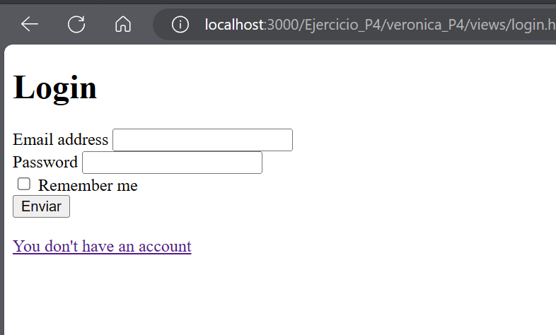
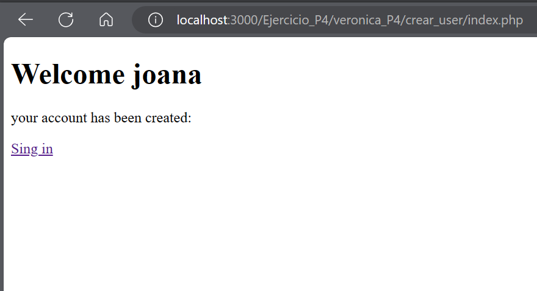
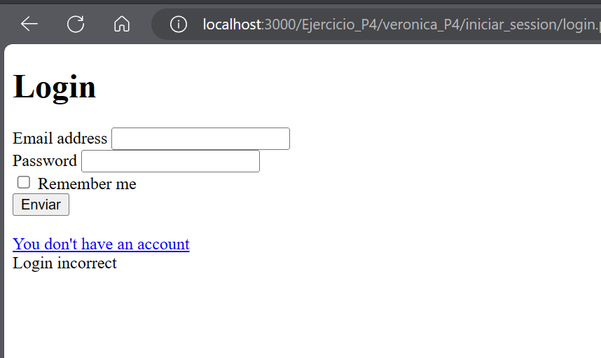
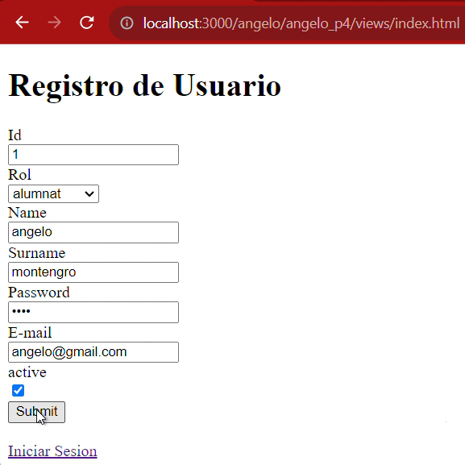
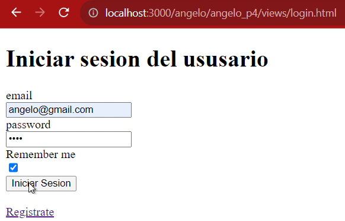
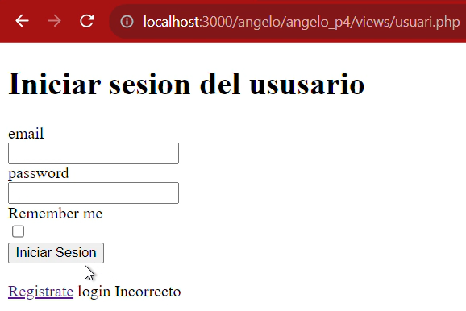
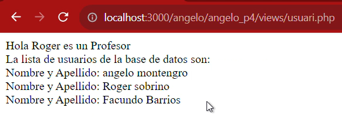

# ALTA USUARI AMB PHP I MYSQL 
## Practica 4
### Veronica Cartagena y Angelo Montenegro

**ACTIVITAT**

Després de desenvolupar la pàgina SignIn (per crear usuaris) haurem de desenvolupar la pàgina del login. 
Haurem de fer:

**Un fitxer html  pel login.**
* Serà un formulari amb el mail i el password. 
* Ha de tenir un checkbox “Remember me”
* El formulari haurà de fer servir el mètode POST.
* La pàgina tindrà un enllaç per poder crear un usuari (pàgina de la pràctica anterior)
* Totes les pàgines de la pràctica anterior hauran de tenir un enllaç per anar a login.html

**Un fitxer php per validar l’usuari i contrasenya a les bases de dades.**
Consultarà la informació introduïda a la pàgina de login per comprovar si l’usuari i el password coincideixen amb un registre de les BBDD:
* El tractament serà:
    * Si la consulta retorna un resultat:
        * Si el rol és estudiant; mostrarà per pantalla: el nom, cognom, email
        * Si el rol és professor, mostrarà el nom i cognom del professor i mostrarà la informació de tots els usuaris de les BBDD.
    * En el cas de que no sigui correcte:
        * Tornarà a la pàgina de login i apareixerà un error de “Login incorrecte”.

* Haureu de crear i fer servir una funció per fer la consulta de tots els usuaris quan el rol és professor.
* Les constants de la connexió s'haurà de fer servir a través d’un fitxer extern dbConf.php
* S’haurà de fer servir el try, catch en l’arxiu de connexió.
* Les vistes (del la pàgina login, la pàgina inserció de dades i la pàgina de mostra de dades) s’hauran de posar en una carpeta de nom vistes.

**RESPOSTA EXECUCIÓ**
*   **Veronica Cartagena**

**EXECUCIÓ VIDEO**
[link_video_Ejercicio_P4](https://drive.google.com/file/d/1Q-aON4X1V4khq_4lfSHnUgRlJNrT8_q9/view?usp=share_link)

**EXECUCIÓ IMAGENES**

*  **Angelo Montenegro**

**EXECUCIÓ VIDEO** :
[link_video_Ejercicio_P4](https://drive.google.com/file/d/1pY1ZC3LCiW2hzg_zGZMDjw_A8hQi3aZ_/view)

**EXECUCIÓ IMAGENES**

