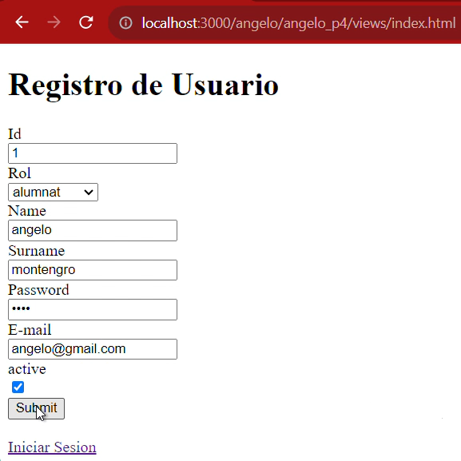
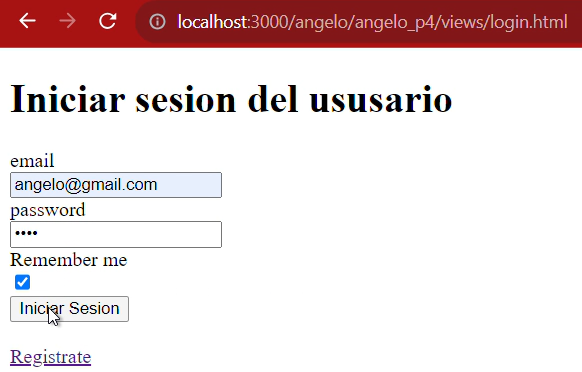
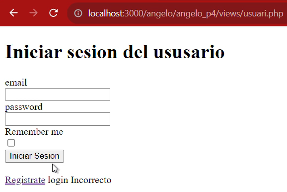
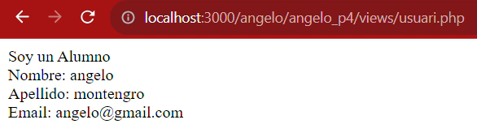
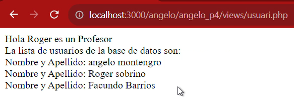

# Practica 4
## Angelo Montenegro 

* **GITHUB**
    * En el mateix repositori de nom **M07_login.**
    * Treballar amb una branca de nom **nomalumne_P4**.
    * A la branca, crear una carpeta amb nom de l’alumne/a i posar dintre els arxius de la pràctica.
    * L’entrega de la pràctica és necessària per a que el professorat sigui conscient dels coneixements adquirits per part de l’alumnat. **(Es revisaran commits)**.
    * **README**
        * Ha d’haver-hi el contingut de **Feina Individual / Grupal.**
        * Afegir les captures demanades (si s’escau) segons el que es demana a **Captures de pantalla.**

* **VIDEO**
    * Entregar d’un vídeo demostratiu on es mostrin les funcionalitats de la pràctica juntament amb les dades de les bases de dades. (Login + inserció de dades)

* **ENTREGA**
    * L’entrega es realitza abans d’acabar la classe.

* **AVALUACIÓ**
    * S’avalua segons rúbrica adjunta.
    * Els errors de compilació resten 0,5 punt per error.
    * No presentar el vídeo representa suspendre la pràctica.

**ACTIVITAT**

Després de desenvolupar la pàgina SignIn (per crear usuaris) haurem de desenvolupar la pàgina del login. 
Haurem de fer:

**Un fitxer html  pel login.**
* Serà un formulari amb el mail i el password. 
* Ha de tenir un checkbox “Remember me”
* El formulari haurà de fer servir el mètode POST.
* La pàgina tindrà un enllaç per poder crear un usuari (pàgina de la pràctica anterior)
* Totes les pàgines de la pràctica anterior hauran de tenir un enllaç per anar a login.html

**Un fitxer php per validar l’usuari i contrasenya a les bases de dades.**
Consultarà la informació introduïda a la pàgina de login per comprovar si l’usuari i el password coincideixen amb un registre de les BBDD:
* El tractament serà:
    * Si la consulta retorna un resultat:
        * Si el rol és estudiant; mostrarà per pantalla: el nom, cognom, email
        * Si el rol és professor, mostrarà el nom i cognom del professor i mostrarà la informació de tots els usuaris de les BBDD.
    * En el cas de que no sigui correcte:
        * Tornarà a la pàgina de login i apareixerà un error de “Login incorrecte”.

* Haureu de crear i fer servir una funció per fer la consulta de tots els usuaris quan el rol és professor.
* Les constants de la connexió s'haurà de fer servir a través d’un fitxer extern dbConf.php
* S’haurà de fer servir el try, catch en l’arxiu de connexió.
* Les vistes (del la pàgina login, la pàgina inserció de dades i la pàgina de mostra de dades) s’hauran de posar en una carpeta de nom vistes.

**RESPOSTA EXECUCIÓ**
*   **Veronica Cartagena**

**RESPOSTA EXECUCIÓ VIDEO**

*   **Angelo Montenegro**

**RESPOSTA EXECUCIÓ VIDEO**
